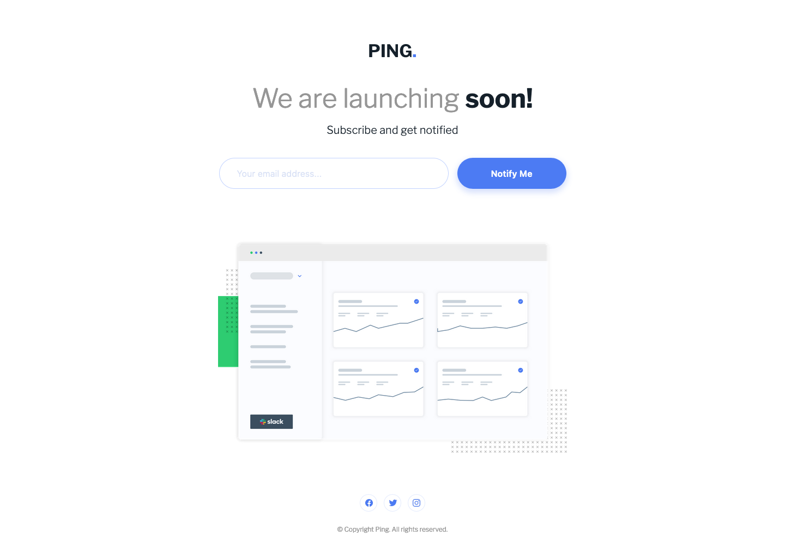

# Ping coming soon page solution

This is a solution to the [Ping coming soon page challenge on Frontend Mentor](https://www.frontendmentor.io/challenges/ping-single-column-coming-soon-page-5cadd051fec04111f7b848da).

## Table of contents

-   [Screenshot](#screenshot)
-   [Links](#links)
-   [Built with](#built-with)
-   [Author](#author)

## Screenshot

## Links

-   [Solution URL](https://github.com/ionStici/ping-coming-soon-page)
-   [Live Site URL](https://ionstici.github.io/ping-coming-soon-page)

## Built with

-   Semantic HTML5 markup
-   Media queries and Flexbox
-   Mobile-first workflow
-   JavaScript and Forms

## Author

-   [GitHub](https://github.com/ionStici)
-   [Frontend Mentor](https://www.frontendmentor.io/profile/ionStici)
-   [Twitter](https://twitter.com/ionStici_)

<!-- ### Primary

-   Blue: hsl(223, 87%, 63%)

### Secondary

-   Pale Blue: hsl(223, 100%, 88%)
-   Light Red: hsl(354, 100%, 66%)

### Neutral

-   Gray: hsl(0, 0%, 59%)
-   Very Dark Blue: hsl(209, 33%, 12%)

### Body Copy

-   Font size: 20px

### Fonts

-   Family: [Libre Franklin](https://fonts.google.com/specimen/Libre+Franklin)
-   Weights: 300, 600, 700

## Icons

For the social icons, you can use a font icon library. Some suggestions can be found below:

-   [Font Awesome](https://fontawesome.com)
-   [IcoMoon](https://icomoon.io)
-   [Ionicons](https://ionicons.com) -->
